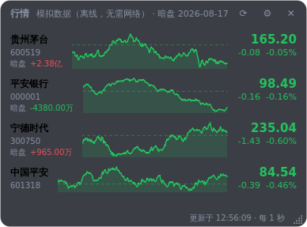
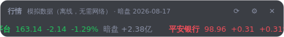
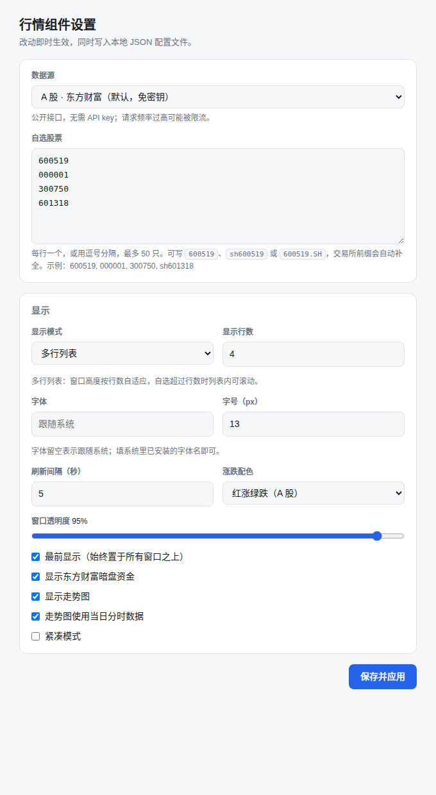

# A 股行情桌面组件 · Stock Ticker Widget

一个常驻桌面的悬浮行情小窗：无边框、半透明、最前显示、可拖拽，托盘常驻。
**所有参数都在浏览器里改**，配置以 JSON 存储。基于 Python + PySide6 + Flask，
**默认离线可用**——首次启动无需网络、无需 API key。



## 特性

- **悬浮小窗**：无边框 + 半透明圆角卡片，标题栏任意位置可拖动，右下角可拉伸宽度
- **最前显示**：可开关，开启后始终置于所有窗口之上
- **WebUI 设置**：所有参数在浏览器里改，改完立刻下发到桌面窗口并写入 JSON
- **两种显示模式**：多行列表 / 单行横向滚动（鼠标悬停暂停），多行模式可设置显示行数，窗口高度自适应
- **字体可改**：字体与字号都能设置，界面所有字号按基准字号等比缩放
- **A 股数据源可插拔**：东方财富（默认）、腾讯、新浪三个免密钥公开接口，外加一个离线模拟源
- **东方财富暗盘资金**：每只股票显示当日暗盘资金，红正绿负（跟随涨跌配色）
- **当日分时图**：每行内嵌当天的分时曲线，面积填充 + 昨收虚线基准，颜色跟随涨跌
- **涨跌配色可切**：红涨绿跌（A 股习惯）/ 绿涨红跌（欧美习惯）
- **状态持久化**：自选、模式、行数、字体、透明度、窗口位置尺寸，重启后自动恢复
- **逐行降级**：某只股票取不到数只在该行显示原因，不影响其他行情

单行滚动模式：



## 快速开始

用 [uv](https://docs.astral.sh/uv/) 管理虚拟环境与依赖：

```bash
uv sync                      # 按 uv.lock 创建 .venv 并装好依赖
uv run stock-ticker-widget   # 启动（等价于 uv run python -m stockwidget）
```

`uv sync` 会自己建 `.venv`，不需要手动 `python -m venv`，也不需要 `activate`——
`uv run` 会直接用项目的虚拟环境。本机没有合适的 Python 时，uv 会按 `requires-python`
自动下载一个。

还没装 uv 的话：

```bash
curl -LsSf https://astral.sh/uv/install.sh | sh      # macOS / Linux
powershell -c "irm https://astral.sh/uv/install.ps1 | iex"   # Windows
```

依赖版本锁在 `uv.lock` 里并随仓库提交，任何机器上 `uv sync` 装出来的都是同一套版本。
改动依赖后跑 `uv lock` 更新它。

启动后终端会打印一行设置页地址（带一次性 token），点组件右上角 ⚙ 或托盘菜单「设置…」
也会直接在默认浏览器里打开它。

### 运行环境要求

锁定的 PySide6 只提供二进制 wheel、没有源码包，所以能装的平台由它的 wheel 决定：

| 平台 | 要求 |
| --- | --- |
| Windows | x86-64 / ARM64 |
| macOS | **13 及以上**（universal2） |
| Linux x86-64 | glibc **2.34** 及以上（Ubuntu 22.04+、Debian 12+） |
| Linux ARM64 | glibc **2.39** 及以上（Ubuntu 24.04+） |

不满足时 `uv sync` 会直接报找不到可用的 wheel。macOS 12 可以退到 PySide6 6.9.x
（那一支还提供 `macosx_12_0` 的包）：

```bash
uv add "PySide6-Essentials>=6.6,<6.10"
```

Linux ARM64 的 glibc 2.39 门槛则退不了——上游从 6.9 到 6.11 的 aarch64 wheel 都是这个下限，
只能换更新的发行版，或自行编译 Qt。

> Linux 上如果 Qt 报 `Could not load the Qt platform plugin "xcb"`，
> 装一下系统库：`sudo apt install libegl1 libxkbcommon-x11-0 libxcb-cursor0`。

## WebUI 设置



开关与下拉改完立即生效；文本和数字输入框在失焦或点「保存并应用」后生效。
服务只监听 `127.0.0.1`，且每次启动生成一个随机 token —— 没有 token 的请求一律 403，
同一台机器上的其他用户改不了你的配置。

| 设置 | 默认值 | 说明 |
| --- | --- | --- |
| 数据源 | 东方财富 | 见下表 |
| 自选股票 | `600519 000001 300750 601318` | 每行一个或逗号分隔，最多 50 只，自动去重 |
| 显示模式 | 多行列表 | 可切换为单行横向滚动 |
| 显示行数 | 4 | 1–30 行，窗口高度随之自适应；单行模式下不生效 |
| 字体 | 跟随系统 | 填系统里已安装的字体名，如 `Microsoft YaHei` |
| 字号 | 13px | 9–28px，界面整体等比缩放 |
| 刷新间隔 | 5 秒 | 1–3600 秒 |
| 涨跌配色 | 红涨绿跌 | 可切换为绿涨红跌 |
| 窗口透明度 | 95% | 20%–100% |
| 最前显示 | 开 | 关掉后组件会被其他窗口盖住 |
| 暗盘资金 | 开 | 显示东方财富当日暗盘资金 |
| 走势图 | 开 | 紧凑模式下自动隐藏 |
| 走势图用分时数据 | 开 | 关掉后不联网取分时，只画组件运行期间的采样点 |
| 紧凑模式 | 关 | 隐藏代码、走势图、暗盘与页脚 |

### 配置文件

配置是一份普通的 JSON，也可以直接编辑：

- macOS `~/Library/Application Support/stock-ticker-widget/config.json`
- Windows `%APPDATA%\stock-ticker-widget\config.json`
- Linux `~/.config/stock-ticker-widget/config.json`

磁盘上的内容和 WebUI 提交的表单都会经过同一套校验（类型检查 + 区间夹取），
写坏了不会让程序起不来，只会回落到默认值。

## 数据源

| 数据源 | 说明 | 覆盖范围 |
| --- | --- | --- |
| `eastmoney` | 东方财富 push2 接口，**默认** | 沪 / 深 / 北 |
| `tencent` | 腾讯行情 `qt.gtimg.cn` | 沪 / 深 / 北 |
| `sina` | 新浪财经 `hq.sinajs.cn` | 沪 / 深 / 北 |
| `mock` | 离线随机游走，不联网、不需要密钥 | 任意代码 |

三个联网数据源都是公开接口，无需注册，但**请求频率过高可能被限流**；刷新间隔建议不低于 3 秒。
在受限网络中它们可能被拦截，此时组件会在对应行显示 `HTTP 403` 之类的原因，
其余功能不受影响——切回 `mock` 即可正常使用。

### 股票代码写法

`600519`、`sh600519`、`600519.SH` 都可以，不写前缀时按号段自动判断交易所
（`60/68/90/5x` → 沪，`00/30/20/1x/39` → 深，`43/83/87/88/92` → 北交所）。

### 新增数据源

在 `stockwidget/providers/` 下加一个类，提供 `id` / `label` / `placeholder` 和
`fetch(symbols) -> list[Quote]`，再到 `providers/__init__.py` 的 `PROVIDERS` 里注册即可。
新浪与腾讯这类「GBK 文本 + 按位置取字段」的接口可以直接继承 `TextQuoteProvider`，
只声明正则、分隔符和字段下标。

## 当日分时图

每行中间那条曲线是**当天的分时走势**，不是组件运行期间攒出来的采样点——后者只有开着
程序的那段时间，画不出完整的一天。曲线以下按涨跌配色做淡填充，横向虚线是**昨收基准**，
纵向范围会把昨收算进去，所以基准线不会跑出图外。

数据源与字段口径对齐 `gupiao_ztfx` 的 `trading/services/intraday_kline.py`：

| 数据源 | 接口 | 说明 |
| --- | --- | --- |
| 东方财富（主） | `push2his.eastmoney.com/api/qt/stock/trends2/get` | 每分钟一条「时间,开,收,高,低,量,额,均价」，取收盘价；`preClose` 作基准 |
| 腾讯（兜底） | `web.ifzq.gtimg.cn/appstock/app/minute/query` | 东财无数据或失败时启用，每行「HHMM 价格 累计量 累计额」 |

只保留 A 股标准交易时段（09:30–11:30、13:00–15:00），盘前集合竞价与午休的点会被滤掉。
分钟级数据在客户端缓存 60 秒，不跟着行情每几秒重拉。取不到时该行自动回退成采样点曲线，
不影响其他信息；也可以在设置里关掉「走势图用分时数据」，彻底不发这部分请求。

## 暗盘资金

数据来自东方财富灰盘排行接口 `quotederivates.eastmoney.com/datacenter/darktrade`，
字段口径与仓库 `gupiao_ztfx` 的 `src/dark_trade/eastmoney.py` 保持一致：

| 字段 | 含义 | 说明 |
| --- | --- | --- |
| `6` | 暗盘资金 | 单位为元，界面按 万 / 亿 折算显示 |
| `8` | 主力净流入 | 单位为元 |
| `13` | 价格 | 接口放大了 1000 倍，读取时还原 |
| `4` / `16` / `3` | 代码 / 名称 / 市场 | 市场 `1` 为沪、`0` 为深 |

该接口返回的是**某个交易日的暗盘排行榜**（按暗盘资金降序分页），因此实现上会翻页收集，
自选股全部命中即提前停止，最多翻 50 页。这是日频数据，客户端内缓存 10 分钟，不跟行情同频请求。
当日没有暗盘成交的股票不在榜内，界面上该行不显示暗盘。

## 项目结构

```
stockwidget/
  app.py             把配置、轮询、窗口、托盘、WebUI 接到一起
  __main__.py        uv run python -m stockwidget 入口
  config.py          JSON 配置读写与校验
  symbols.py         A 股代码归一化（沪深北）
  poller.py          后台轮询线程，行情 + 暗盘 + 分时合并后发信号给界面
  darktrade.py       东方财富暗盘资金（分页 + 缓存）
  intraday.py        当日分时曲线（东财 trends2，腾讯兜底 + 缓存）
  providers/
    base.py          Quote 结构与数据源协议
    eastmoney.py     东方财富行情（默认）
    textquote.py     新浪 / 腾讯（GBK 文本接口共用实现）
    mock.py          离线模拟行情
  ui/
    window.py        悬浮窗：标题栏、列表、页脚、尺寸自适应
    quote_row.py     单行行情
    marquee.py       单行滚动跑马灯
    sparkline.py     走势图（分时曲线 + 昨收基准 + 面积填充）
    tray.py, icon.py 托盘与图标（图标用 QPainter 现画）
    theme.py         配色、字体与数字格式化
  webui/
    server.py        Flask 设置服务（回环地址 + token）
    templates/, static/
tests/               pytest 单元测试
scripts/smoke.py     真正跑一遍的冒烟测试，可选出图
pyproject.toml       依赖与项目元数据（uv 读这份）
uv.lock              锁定的依赖版本，随仓库提交
```

## 测试

```bash
uv run pytest                              # 单元测试
uv run python scripts/smoke.py             # 真启动一次，检查窗口与 WebUI
uv run python scripts/smoke.py --shots docs/   # 顺便更新截图
```

单元测试覆盖配置校验、代码归一化、各数据源解析与失败降级、暗盘字段映射与分页缓存、
WebUI 的鉴权与读写。冒烟脚本会真正把 Qt 窗口和 Flask 服务跑起来，验证行情渲染、
暗盘显示、字号与行数变化后的窗口自适应、单行模式，以及**从 WebUI 改配置后桌面窗口是否跟着变**。
没有图形环境时会自动套 `xvfb-run`。

## 已知限制

- 托盘图标在部分 Linux 桌面环境需要 `libappindicator` / dbus 支持，缺失时托盘不显示，组件窗口本身不受影响
- 半透明窗口需要桌面开启混成（compositing），未开启时背景会呈不透明纯色
- 尚未接入打包（PyInstaller 等），目前以源码方式运行

## 许可

MIT
