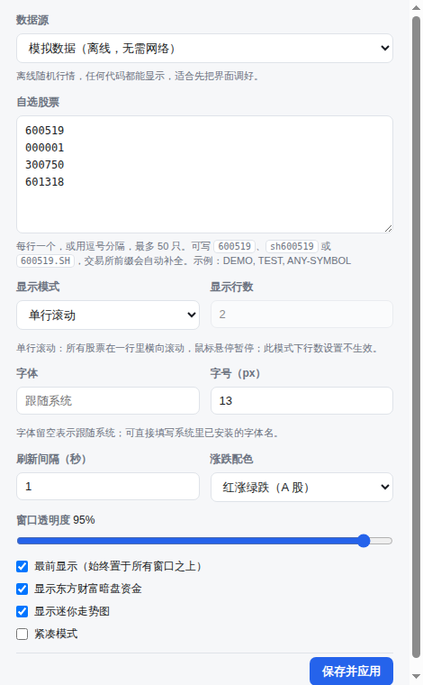

# A 股行情桌面组件 · Stock Ticker Widget

一个常驻桌面的悬浮行情小窗：无边框、半透明、最前显示、可拖拽，托盘常驻。
面向 A 股，基于 Electron，**默认离线可用**——首次启动无需网络、无需 API key。


## 特性

- **悬浮小窗**：无边框 + 毛玻璃背景，标题栏任意位置可拖动，不占任务栏
- **最前显示**：可开关，开启后始终置于所有窗口之上（含全屏应用）
- **两种显示模式**：多行列表 / 单行横向滚动，多行模式可设置显示行数，窗口高度自适应
- **字体可改**：字体与字号都能设置，整个界面按字号等比缩放
- **A 股数据源可插拔**：东方财富（默认）、腾讯、新浪三个免密钥公开接口，外加一个离线模拟源
- **东方财富暗盘资金**：每只股票显示当日暗盘资金，红正绿负（跟随涨跌配色）
- **迷你走势图**：每行内嵌最近 40 个采样点的价格曲线，颜色跟随涨跌
- **涨跌配色可切**：红涨绿跌（A 股习惯）/ 绿涨红跌（欧美习惯）
- **状态持久化**：自选、模式、行数、字体、透明度、窗口位置尺寸，重启后自动恢复
- **逐行降级**：某只股票取不到数只在该行显示原因，不影响其他行情

单行滚动模式（鼠标悬停暂停）：


## 快速开始

```bash
npm install
npm start
```

点组件右上角 ⚙ 打开设置，换数据源、填自己的自选股票。

## 数据源

| 数据源 | 说明 | 覆盖范围 |
| --- | --- | --- |
| `eastmoney` | 东方财富 push2 接口，**默认** | 沪 / 深 / 北 |
| `tencent` | 腾讯行情 `qt.gtimg.cn` | 沪 / 深 / 北 |
| `sina` | 新浪财经 `hq.sinajs.cn` | 沪 / 深 / 北 |
| `mock` | 离线随机游走，不联网、不需要密钥 | 任意代码 |

三个联网数据源都是公开接口，无需注册，但**请求频率过高可能被限流**；刷新间隔建议不低于 3 秒。
在受限网络（公司代理、容器沙箱）中它们可能被拦截，此时组件会在对应行显示 `HTTP 403` 之类的原因，
其余功能不受影响——切回 `mock` 即可正常使用。

### 股票代码写法

`600519`、`sh600519`、`600519.SH` 都可以，不写前缀时按号段自动判断交易所
（`60/68/90/5x` → 沪，`00/30/20/1x/39` → 深，`43/83/87/88/92` → 北交所）。

### 新增数据源

在 `src/main/providers/` 下加一个模块，导出 `{ id, label, placeholder, fetchQuotes }`，
并在 `src/main/providers/index.js` 里注册。`fetchQuotes(symbols)` 返回统一结构：

```js
{
  symbol, name, price, prevClose,
  change, changePercent, currency,
  time,            // 毫秒时间戳
  error,           // 该代码取数失败的原因，成功时为 null
}
```

## 暗盘资金

数据来自东方财富灰盘排行接口 `quotederivates.eastmoney.com/datacenter/darktrade`，
字段口径与仓库 `gupiao_ztfx` 的 `src/dark_trade/eastmoney.py` 保持一致：

| 字段 | 含义 | 说明 |
| --- | --- | --- |
| `6` | 暗盘资金 | 单位为元，界面按 万 / 亿 折算显示 |
| `8` | 主力净流入 | 单位为元 |
| `13` | 价格 | 接口放大了 1000 倍，读取时还原 |
| `4` / `16` / `3` | 代码 / 名称 / 市场 | 市场 `1` 为沪、`0` 为深 |

该接口返回的是**某个交易日的暗盘排行榜**（按暗盘资金降序分页），因此实现上会翻页收集，
自选股全部命中即提前停止，最多翻 50 页。这是日频数据，模块内缓存 10 分钟，不跟行情同频请求。
当日没有暗盘成交的股票不在榜内，界面上该行不显示暗盘。

## 设置项

| 设置 | 默认值 | 说明 |
| --- | --- | --- |
| 数据源 | 东方财富 | 见上表 |
| 自选股票 | `600519 000001 300750 601318` | 每行一个或逗号分隔，最多 50 只，自动去重 |
| 显示模式 | 多行列表 | 可切换为单行横向滚动 |
| 显示行数 | 4 | 1–30 行，窗口高度随之自适应；单行模式下不生效 |
| 字体 | 跟随系统 | 填系统里已安装的字体名，如 `Microsoft YaHei` |
| 字号 | 13px | 9–28px，整个界面等比缩放 |
| 刷新间隔 | 5 秒 | 1–3600 秒 |
| 涨跌配色 | 红涨绿跌 | 可切换为绿涨红跌 |
| 窗口透明度 | 95% | 20%–100% |
| 最前显示 | 开 | 关掉后组件会被其他窗口盖住 |
| 暗盘资金 | 开 | 显示东方财富当日暗盘资金 |
| 迷你走势图 | 开 | 紧凑模式下自动隐藏 |
| 紧凑模式 | 关 | 隐藏名称、走势图、暗盘与页脚 |



开关与下拉改完立即生效；文本和数字输入框在失焦或点「保存并应用」后生效。
配置写在 Electron 的用户数据目录下：

- macOS `~/Library/Application Support/stock-ticker-widget/config.json`
- Windows `%APPDATA%\stock-ticker-widget\config.json`
- Linux `~/.config/stock-ticker-widget/config.json`

## 项目结构

```
src/main/            主进程
  main.js            窗口 / 托盘 / 轮询 / IPC / 高度自适应
  store.js           配置读写与校验
  preload.js         暴露给渲染进程的 API 白名单
  darktrade.js       东方财富暗盘资金（分页 + 缓存）
  providers/
    index.js         数据源注册表
    symbols.js       A 股代码归一化（沪深北）
    gbk.js           GBK 解码（新浪/腾讯共用）
    eastmoney.js     东方财富行情（默认）
    tencent.js       腾讯行情
    sina.js          新浪行情
    mock.js          离线模拟行情
src/renderer/        渲染进程
  index.html         组件窗口（多行列表 + 单行跑马灯）
  settings.html      设置窗口
scripts/
  make-icon.js       生成托盘图标（不依赖任何图形库）
  smoke.js           冒烟测试
```

## 安全设计

- 渲染进程禁用 Node（`contextIsolation: true` / `nodeIntegration: false`），只能调用 preload 白名单里的方法
- 两个页面都声明了 CSP，禁止外部资源与内联脚本
- 所有行情请求都在主进程发起，渲染进程不直接触网，也就不受 CORS 与凭据泄露影响
- 磁盘上的配置和渲染进程传来的配置一律经过 `sanitize()` 校验和区间夹取后才使用；
  字体名只接受中英文、数字、空格、引号、逗号和连字符，挡掉样式注入

## 测试

```bash
npm run smoke
```

先跑纯逻辑检查（配置校验、代码归一化、各数据源解析、暗盘字段映射、东财价格缩放识别），
再真正启动一次 Electron，确认窗口能加载且渲染进程没有未捕获异常或 CSP 违规。
无图形环境时会自动套 `xvfb-run`；两者都没有时会跳过启动检查并说明原因。

## 已知限制

- 托盘图标在部分 Linux 桌面环境需要 `libappindicator` / dbus 支持，缺失时托盘可能不显示，组件窗口本身不受影响
- 透明窗口需要桌面开启混成（compositing），未开启时背景会呈不透明纯色
- 多行模式下窗口高度按首行高度乘行数估算，各行高度不一致时（部分股票无暗盘数据）会有几像素误差
- 尚未接入打包（`electron-builder` 等），目前以源码方式运行

## 许可

MIT
